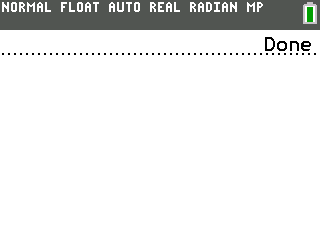

# WIP File Explorer for TI CE Calculators

This is a **work-in-progress** (WIP) file explorer application built for TI CE calculators using the **CE C Compiler Toolchain (CECToolchain)**.

The current builtin-one from TI is completely f\*cked up, and is not very usable at all. You don't have search, sorting, or even at least a better UI.

## ⚡Never delete appvars like fileioc or Libload since they're used in the program ( a warning has to be implemented )

## Screenshot:

(Actually during the recording I've jumped to the bottom so don't think there was a bug/perf issue 🫡) 

## 🚧 Current Features - howto

- Lists all programs and appvars in the archive and RAM. (More filetypes are coming, the fact is just that you'll have a different interaction with them compared to programs and appvars )
- Displays each file's size in bytes
- Acts as a shell -> you can launch programs.
- Delete, des-archive, copy and rename files with a single keypress.
    - Press ← and → arrow to jump to bottom-top 
    - Press del/suppr/F4 to delete a file
    - Press F2(window) to rename a file.
    - Press F1(y=) to open/launch a program (works in 99% of cases I guess)
    - Press F3(zoom) to copy a file. It normally copies it to the RAM memory for now \[Could lead to a memory GC issue which can break the app's state\]
    - Press sto→ to archive/des-archive files. \[Could lead to a memory GC issue which can break the app's state\]
    - And of course, to leave to app, simply press MODE or F5(graph)
    - While entering names (for renaming) → alpha toggle \[upper-lower\]case and 2nd/shift toggle non alpha characters (numbers). 

## 📌 Notes

- Not finished , you can only list some of the files and their sizes + of course do some basic operations. 
- Big issues since the calculator does a garbage collector which destroy the app's state. (Still working one)
- Future features may include: categorization,searching, and sorting.
- UI is probably gonna change a little bit. Some icons and a better "global" style is not a option but a duty 🥹

## 📝 Usage

1. If you want to compile it, compile it using the [CE C Toolchain](https://github.com/CE-Programming/toolchain), else simply grabs the latest version in releases.
2. Transfer the `.8xp` file to your calculator using TI-Connect CE, and launch artifice | asmhook to run it. [https://yvantt.github.io/arTIfiCE/](https://yvantt.github.io/arTIfiCE/) (If your calculator's OS is older than 5.4.0, just execute it direclty ).

Built with the [CE C Toolchain](https://github.com/CE-Programming/toolchain) – for developing C programs on TI-84+ CE calculators
